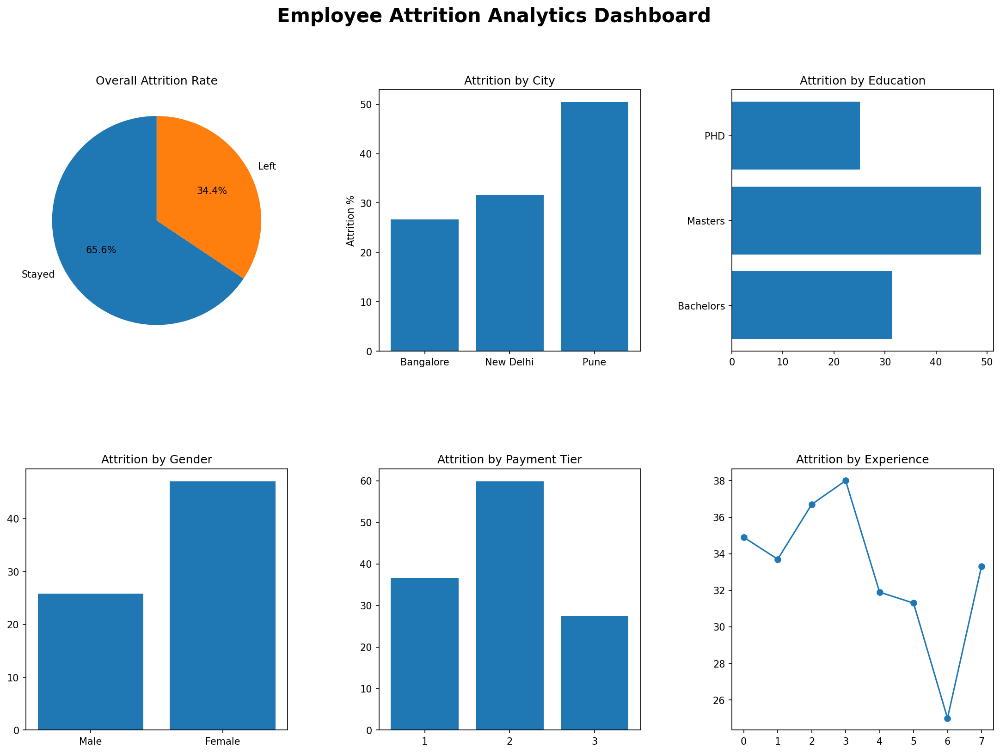

# Employee Attrition Analytics System

## Overview
Developed an Employee Attrition Analytics System using Python, MySQL, Pandas, and Matplotlib. The project imports employee data into a MySQL database, performs SQL-based analysis, and generates a visual dashboard to identify employee attrition trends.

## Dataset
- Total Records: 4,653 Employees
- Source: Employee Attrition Dataset

## Features

- **CSV to MySQL Data Import**
  - Imported and stored 4,653 employee records from a CSV dataset into a MySQL database.

- **Database Management**
  - Used MySQL to organize employee information and perform structured data operations.

- **SQL-Based Analytics**
  - Executed SQL queries to analyze employee attrition patterns and workforce trends.

- **Attrition Dashboard**
  - Generated a visual analytics dashboard using Matplotlib for easy interpretation of results.

- **City-wise Analysis**
  - Compared employee distribution and attrition rates across different cities.

- **Education-wise Analysis**
  - Evaluated attrition trends based on employees' educational qualifications.

- **Gender-wise Analysis**
  - Analyzed workforce composition and attrition patterns across genders.

- **Payment Tier Analysis**
  - Studied the relationship between salary tiers and employee attrition.

- **Experience-Based Analysis**
  - Examined how years of experience in the current domain influence attrition rates.

## Technologies Used
- Python
- MySQL
- Pandas
- Matplotlib
- SQL

## Project Structure

```text
Employee-Analysis/
│
├── Employee.csv
├── import_csv.py
├── analytics.py
├── attrition_dashboard.png
├── requirements.txt
└── README.md
```

## Dashboard Preview



## How to Run

### Install Dependencies

```bash
pip install -r requirements.txt
```

### Import Data into MySQL

```bash
python import_csv.py
```

### Generate Analytics Dashboard

```bash
python analytics.py
```
## Results
- Successfully imported 4,653 employee records into MySQL.
- Generated a multi-chart analytics dashboard.
- Performed SQL-driven analysis on employee attrition patterns.

## Requirements
- matplotlib
- mysql-connector-python

## Author
- Yuvraj Punia
- Pukhraj Singh
